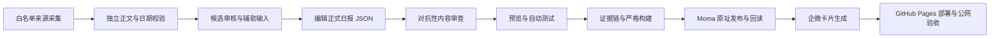

# 山城选题日报

面向重庆房产经纪人的选题日报。项目把公开资讯采集、来源核验、内容编辑、严格构建、Moma 发布、企业微信卡片和 GitHub Pages 部署串成一条可追溯的生产线。

> 流程基线：2026-08-30。详细操作、质量门禁、异常处理和新人接手说明见[《日报生产全流程》](日报生产全流程.md)。

## 在线入口

- [查看最新日报](https://flyyq135.github.io/shancheng-daily-preview/)
- [企微卡片 JSON](https://flyyq135.github.io/shancheng-daily-preview/latest-wecom-card.json)
- [完整生产流程](日报生产全流程.md)

## 一眼看懂生产线

## 三道质量门禁

1. **候选门禁**：来源在白名单内，独立正文可提取，标题、日期和地域一致；验证页、栏目页、营销稿和无关内容不得进入编辑池。
2. **成品门禁**：标题和每条要点都绑定原文证据；数字、单位、范围、实施阶段和正文指纹一致；自动测试和严格构建全部通过。
3. **发布门禁**：Moma 沿用同一期文件 ID 原址更新并完成远端回读；企微卡片与 GitHub Pages 指向同一正式日报；公网内容验收通过后才能宣布完成。

## 内容原则

- 日报首先服务用户关注度和经纪人的当日谈资，不按题材机械凑数。
- 三条重点优先重庆全市和主城 8 区的重大、广泛影响事项，不固定题材槽位。
- 资讯要点只写原文事实，不重复标题，不混入建议、推断、网页噪声或宣传语。
- 区域聚焦使用当月合格候选，每区保留入口但不以会议和弱活动稿补空白。
- 选题推荐放在区域聚焦之后，不把普通城市新闻强行关联购房。
- 往期日报只显示日期和跳转入口，不展示期次、标题或摘要。
- 企微卡片只展示 4 条不同信息增量的当日已核验要闻，不发送大段模块说明。

## 发布产物

| 产物 | 用途 |
|---|---|
| `index.html`、`report-data.js` | GitHub Pages 最新一期 |
| `archive/` | 已发布日报归档 |
| `latest-wecom-card.json` | 企业微信模板卡片固定地址 |
| `latest-wecom.json`、`latest-wecom.txt` | 机器读取和纯文本降级 |
| `日报生产全流程.md` | 完整生产、验收和异常处理 SOP |

本仓库公开展示的是已验证的页面产物和生产说明。正式内容在通过来源校验、证据链、严格构建和公网回读前，不进入对外交付。
