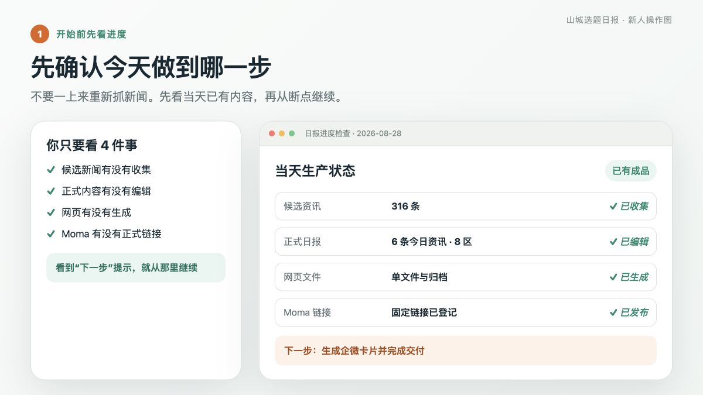

# 山城选题日报

这是一份给重庆房产经纪人使用的每日内容清单。

它每天做三件事：**找出真实资讯、挑出用户更关心的话题、生成可以直接转发的日报和企微卡片。**

> 当前流程：2026-08-30 版。不会写代码也能先读懂；需要操作时，再打开每一步下面的“技术命令”。

## 直接入口

- [查看最新日报](https://flyyq135.github.io/shancheng-daily-preview/)
- [查看企微卡片 JSON](https://flyyq135.github.io/shancheng-daily-preview/latest-wecom-card.json)
- [打开新人版完整流程](日报生产全流程.md)

## 每天只做 8 步

| 步骤 | 要做什么 | 看到什么算完成 |
|---|---|---|
| 1 | 看今天做到哪一步 | 系统明确提示“下一步” |
| 2 | 收集并筛选资讯 | 来源、标题、日期和正文都能核对 |
| 3 | 挑当天值得看的内容 | 重点、资讯、8 区、楼市数据等模块齐全 |
| 4 | 检查标题和要点 | 要点补充新事实，不重复标题、不写空话 |
| 5 | 生成正式网页 | 自动测试和严格检查全部通过 |
| 6 | 更新 Moma | 同一期沿用原链接，远端内容与本地一致 |
| 7 | 生成企微卡片 | 只保留 4 条当天要闻，链接指向正式日报 |
| 8 | 发布并交付 | GitHub Pages 正常，最终交付两个正式链接 |

每一步的完整说明和截图都在[《日报生产全流程》](日报生产全流程.md)。

## 内容怎么选

- **先看用户关注度**：有新变化、具体数字、明确地点、真实反差或直接实用价值的内容优先。
- **重点新闻不能漏**：重庆重大政策、公积金、住房、交通、公共服务和影响范围大的变化必须单独检查。
- **本地重点以重庆和主城 8 区为主**：城口等远郊普通民生稿不能挤占三条重点。
- **不强行关联买房**：机场、城市服务、活动等新闻可以就是本地谈资，不必硬拐到购房。
- **宁缺毋滥**：会议、宣传、营销、过期提醒和无法核验的内容不用来凑数。

## 文字怎么写

- 标题只说原文能够证明的事实。
- 要点必须补充标题之外的数字、地点、对象、范围或实施阶段。
- 不写“原文显示、值得关注、建议、利好、购房者应当”等空话和判断。
- 每个数字和单位都要回到原文核对。
- 往期日报只显示日期和跳转入口，不再显示期次、标题或摘要。

给编辑/Codex：字段和去重规则

- `angle` 在页面以“要点总结”展示，直接按 `1.`、`2.`、`3.` 列出 1—3 条原文关键事实，不以“某网站于某日发布/报道”开头。
- `topic_angle` 只提供 1—2 个可直接用于自媒体的客户向标题。
- 同一资讯事项不得因改写标题、换来源转载或拆分摘要而重复入选；当日资讯标题和来源链接不得重复。
- 标题可由编辑基于原文自定义，最长 34 字；不得新增、推断、夸大或省略会改变事实边界的信息。

## 什么才算真正完成

本地网页生成只是中间结果。必须同时满足：

1. 内容和来源检查通过；
2. Moma 正式日报已更新并完成远端回读；
3. 企微卡片链接指向同一份正式日报；
4. GitHub Pages 和卡片 JSON 在公网可以打开。

最终只交付：

1. **Moma 正式日报链接**；
2. **GitHub 企微卡片 JSON 链接**。

系统只生成企微卡片，不自动发送。
