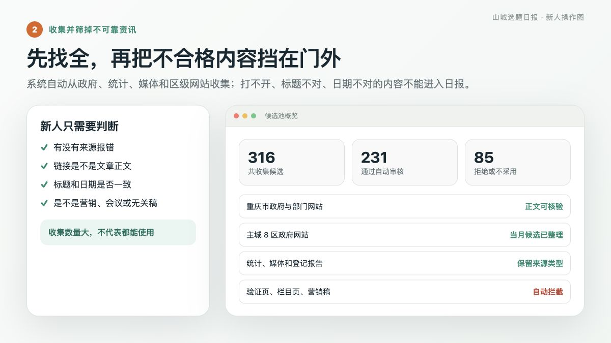
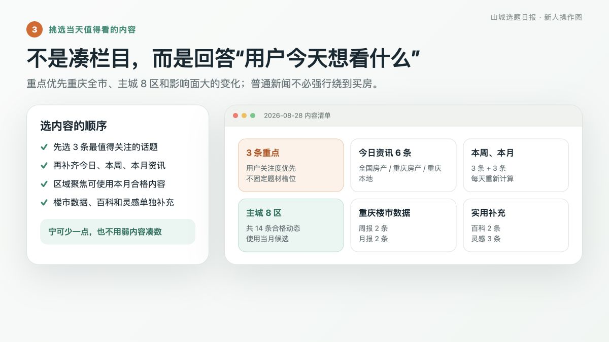
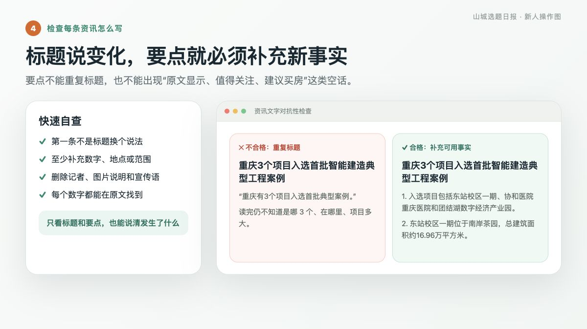
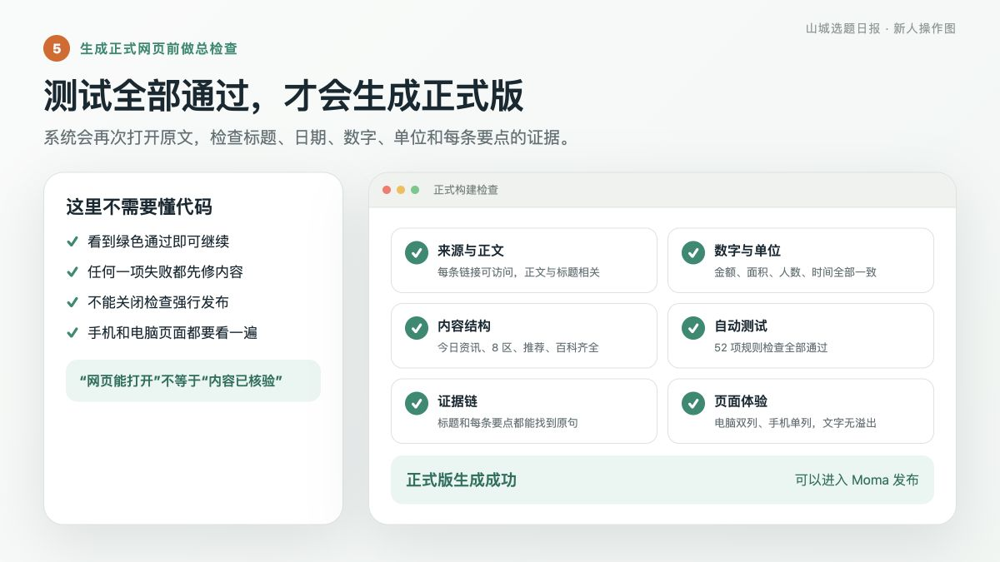
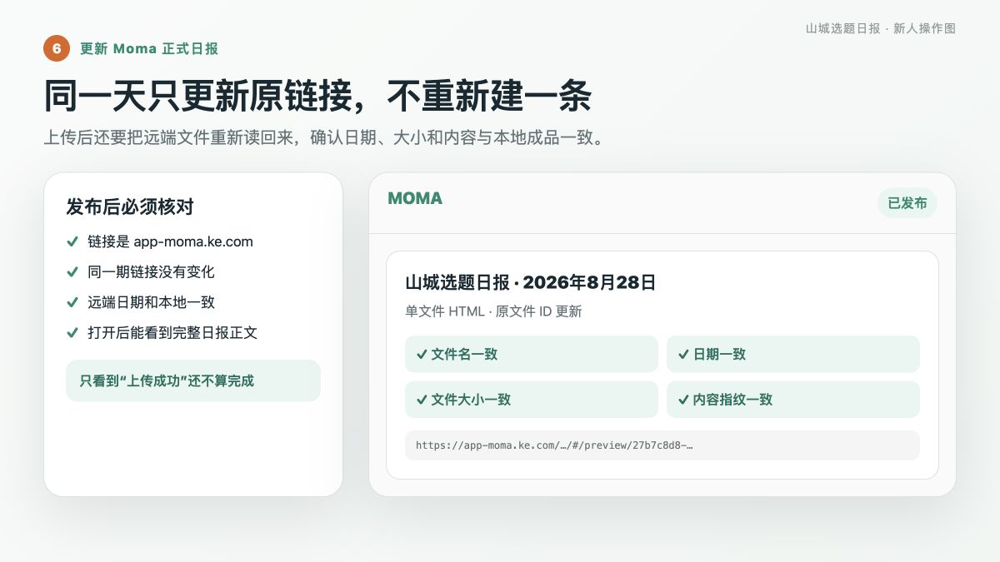
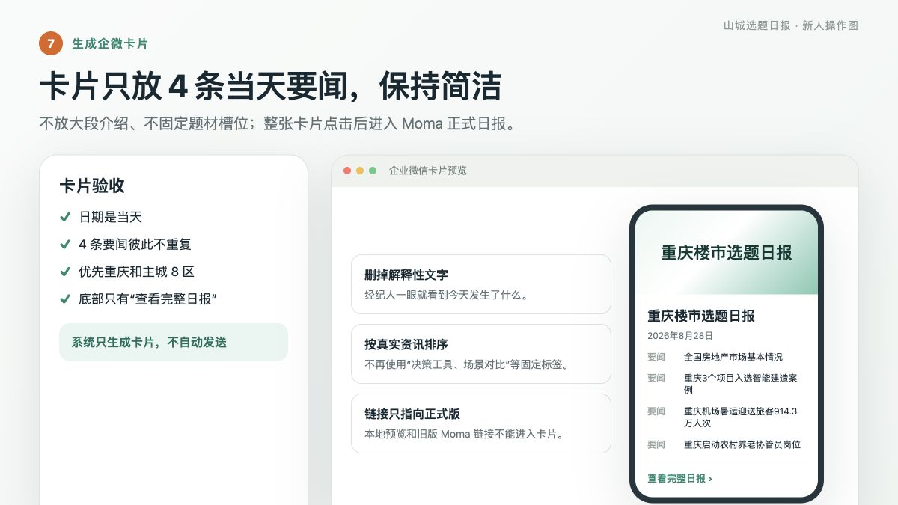
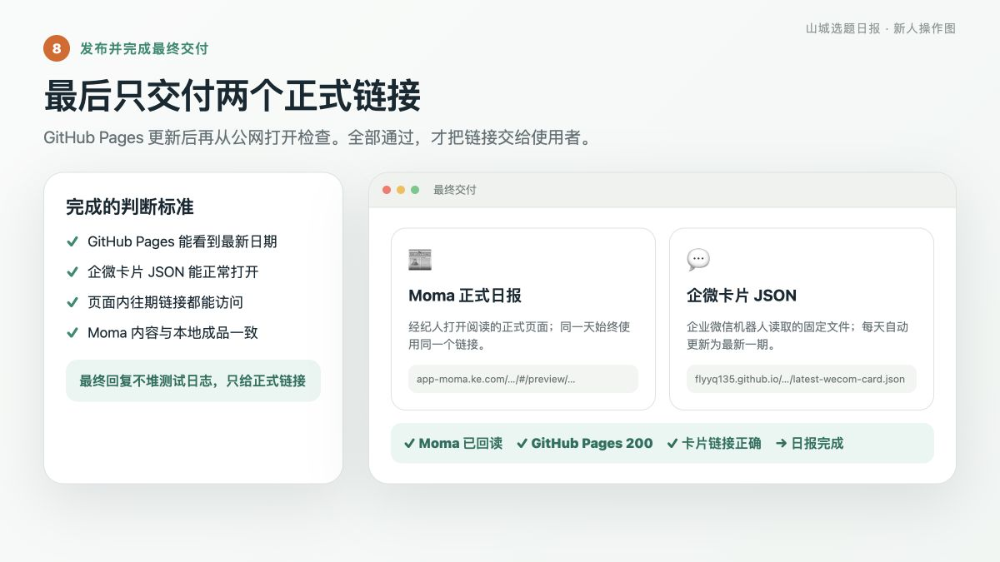

# 山城选题日报：新人版生产全流程

> 适合第一次接手日报的人。先按 8 个步骤往下做；看不懂命令也没关系，先看每一步的“完成标志”和截图。
>
> 当前流程基线：2026-08-30。

## 先记住一句话

日报不是新闻大杂烩。它的目标是：**让重庆房产经纪人今天就能找到 3 件真实、有用、有人愿意看的事。**

## 一张表看懂全流程

| 步骤 | 你要完成的事 | 完成标志 |
|---|---|---|
| 1 | 看进度 | 知道应该从哪一步继续 |
| 2 | 收集资讯 | 不可靠内容已被挡在门外 |
| 3 | 挑内容 | 用户关注度高的内容进入日报 |
| 4 | 检查文字 | 标题、要点和原文事实一致 |
| 5 | 生成正式版 | 所有自动检查通过 |
| 6 | 更新 Moma | 原链接不变，远端内容正确 |
| 7 | 生成企微卡片 | 4 条要闻和正式链接正确 |
| 8 | 发布并交付 | 两个正式链接都能从公网打开 |

---

## 第 1 步：先看今天做到哪一步

不要一上来重新收集新闻。先检查今天是否已经有候选、正式内容、网页和 Moma 链接。


### 你要做什么

1. 输入今天的日期；
2. 运行进度检查；
3. 按系统显示的“下一步”继续。

### 完成标志

你能明确回答：今天是“还没收集”“正在编辑”“已经生成网页”，还是“只差发布”。

### 如果不对

同一天已经有内容时，不要用旧模板覆盖，也不要重复收集；先读取已有文件再续做。

<details>
<summary>需要操作时展开：进度检查命令</summary>

```bash
.venv/bin/python scripts/daily_status.py --date YYYY-MM-DD
```

</details>

---

## 第 2 步：收集并筛掉不可靠资讯

系统会从政府、统计、媒体、区级网站和已登记报告中找候选，同时检查链接、正文、标题和日期。



### 你要做什么

- 看哪些来源成功、哪些来源报错；
- 确认打开的是具体文章，不是首页、栏目页或验证页；
- 拒绝营销、会议、党建、人事、采购、招商和无关外地资讯。

### 完成标志

可用候选都有原文正文、原文标题和发布日期；打不开或对不上的内容已经拒绝或标记待核验。

### 如果不对

“网页返回成功”不代表事实可靠。正文提取不到、标题不相关、日期不一致，都不能进入日报。

<details>
<summary>需要操作时展开：收集命令</summary>

```bash
.venv/bin/python generate_daily_report.py daily --date YYYY-MM-DD
```

采集结果保存在 `data/raw/YYYY-MM-DD.json`，整理后的候选保存在 `data/prepared/YYYY-MM-DD.json`。

</details>

---

## 第 3 步：挑当天真正值得看的内容

不按政策、数据、民生等类别机械占位。先问：**重庆用户今天会不会愿意点开？**



### 挑选顺序

1. 先选 3 条最值得关注的话题；
2. 再整理今日、本周和本月资讯；
3. 补充重庆楼市周报、月报；
4. 检查主城 8 区入口；
5. 最后补购房百科和灵感。

### 重点内容标准

- 优先重庆全市、主城 8 区和影响范围大的变化；
- 公积金、住房、交通、公共服务等重大事项不能漏；
- 城口等远郊普通民生稿不能挤占三条重点；
- 有新变化、具体数字、明确地点、真实反差或直接实用价值的内容优先。

### 各板块怎么处理

- **今日资讯**：通常 6—9 条，宁缺毋滥；
- **本周、本月**：每天重新计算，删除过期活动、天气和临时提醒；
- **区域聚焦**：保留主城 8 区入口，可使用本月符合标准的内容；不用会议和弱活动稿填空；
- **选题推荐**：固定放在区域聚焦之后，每条只写标题、用户为什么关注和来源；
- **普通城市新闻**：可以是本地谈资，不必强行关联买房。

### 完成标志

读者能一眼看出今天最值得关注的 3 件事，同时资讯、楼市数据、8 区、推荐、百科和灵感各自清楚。

<details>
<summary>给编辑/Codex：正式内容保存在哪里</summary>

正式内容保存在 `data/daily/YYYY-MM-DD.json`。只参考上一期的结构，不能复制上一期的日期、数字和结论。

</details>

---

## 第 4 步：逐条检查标题和要点

这一关专门防止“标题和摘要重复”“数字单位写错”“把宣传语当事实”等低级错误。



### 每条资讯都问 5 个问题

1. 标题里的核心变化，要点有没有真正解释？
2. 第一条要点是不是只把标题换了个说法？
3. 有没有补充数字、地点、对象、范围或实施阶段？
4. 有没有混入记者、图片说明、宣传语、联系方式或网页按钮？
5. 每个数字和单位能不能在原文中找到？

### 不能出现的写法

- “原文显示”“原文披露”；
- “值得关注”“建议”“利好”“购房者应当”；
- 原文没有支持的推断；
- 为了房产而强行扭转新闻含义。

### 完成标志

只看标题和要点，也能准确回答：发生了什么、影响谁、涉及哪里、现在进行到哪一步。

---

## 第 5 步：预览、测试并生成正式网页

先生成预览看版式，再运行全部检查。任何一项失败，都先修内容，不能关闭检查强行发布。



### 你要检查什么

- 电脑和手机页面都能正常阅读；
- 今日、本周、本月没有重复和过期内容；
- 主城 8 区入口齐全；
- 3 条推荐位于区域聚焦之后；
- 往期日报只显示日期和跳转入口；
- 自动测试、原文证据、数字单位检查全部通过。

### 完成标志

系统明确显示严格构建成功，并生成当天的单文件网页。

<details>
<summary>需要操作时展开：预览和正式构建命令</summary>

```bash
# 先看预览
.venv/bin/python generate_daily_report.py build data/daily/YYYY-MM-DD.json --preview

# 再运行全部测试
.venv/bin/python -m unittest discover -s tests -v

# 最后生成正式版
.venv/bin/python generate_daily_report.py build data/daily/YYYY-MM-DD.json
```

上传 Moma 的文件是 `output/standalone/YYYY-MM-DD.html`。

</details>

---

## 第 6 步：更新 Moma 正式日报

同一天修改日报时，必须更新原来的 Moma 文件，不能重新建立一个新链接。



### 发布后检查 4 件事

1. 链接以 `https://app-moma.ke.com/` 开头；
2. 同一期的链接没有变化；
3. Moma 中的日期与本地日报一致；
4. 远端文件名、大小、内容指纹和本地成品一致。

### 完成标志

在普通阅读环境打开 Moma 链接，可以看到完整日报正文，而不只是一个空壳页面。

### 如果不对

只有“上传成功”或 HTTP 200 不能算完成。无法原址更新时立即停止，不要静默换链接。

<details>
<summary>给编辑/Codex：Moma 操作命令</summary>

首次发布：

```bash
.venv/bin/python scripts/moma_upload.py output/standalone/YYYY-MM-DD.html --date YYYY-MM-DD
```

同日更新：从 `data/moma-public-links.json` 读取原文件 ID，再用 `--file-id` 原址覆盖。

</details>

---

## 第 7 步：生成企微卡片

企微卡片只帮助经纪人快速看到今天的 4 条要闻，不再塞入大段介绍和模块说明。



### 卡片标准

- 只显示 4 条当天已核验要闻；
- 4 条要闻不能高度重复；
- 价值接近时优先重庆全市、主城 8 区和可立即使用的信息；
- 不固定“决策工具、场景对比”等题材标签；
- 不显示“今日已核验多少条”或打开提醒；
- 底部只保留“查看完整日报”；
- 整张卡片指向当天 Moma 正式链接。

### 完成标志

日期正确、4 条要闻清楚、跳转链接正确。系统只生成卡片，不自动发送。

<details>
<summary>需要操作时展开：生成企微文件</summary>

```bash
.venv/bin/python scripts/make_wecom_copy.py data/daily/YYYY-MM-DD.json
```

固定文件是 `latest-wecom-card.json`。

</details>

---

## 第 8 步：发布 GitHub Pages 并完成交付

GitHub Pages 更新后，必须从公网重新打开日报首页和企微卡片 JSON。



### 最后检查

- 日报首页显示最新日期；
- `latest-wecom-card.json` 可以打开；
- 页面里的当期和往期 Moma 链接可以访问；
- Moma、企微卡片和 GitHub Pages 指向同一期内容。

### 最终只交付两个链接

1. Moma 正式日报；
2. GitHub 企微卡片 JSON：<https://flyyq135.github.io/shancheng-daily-preview/latest-wecom-card.json>。

### 完成标志

两个链接都从公网验收通过。最终回复不堆测试日志和本地文件路径。

---

## 出错时怎么处理

| 遇到的问题 | 正确做法 |
|---|---|
| 某个来源没有内容 | 保留错误记录，继续检查其他合格来源 |
| 重点政策漏掉 | 重新检查重大事项，而不是只看普通排序结果 |
| 8 区大面积空白 | 重查当月候选和原文正文，不用会议稿凑数 |
| 标题与要点重复 | 补充数字、地点、范围或实施阶段；没有新事实就删除 |
| 原文打不开 | 保持待核验，稍后重试或更换同一事实的权威来源 |
| 自动测试失败 | 修数据或来源，不能关闭检查 |
| Moma 无法原址更新 | 停止并报告，不能新建链接偷偷替换 |
| 卡片仍指向旧版 | 先重新发布 Moma 并回读，再生成企微卡片 |

## 新人最后只要记住 5 句话

1. 先看进度，不覆盖已经做好的内容。
2. 新闻能打开，不代表事实已经核验。
3. 要点必须补充新事实，不能重复标题。
4. 本地网页生成，不代表日报已经发布。
5. 两个正式链接都验收通过，日报才算完成。
