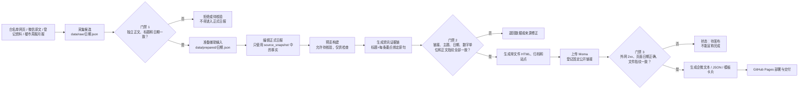

# 山城选题日报：项目全流程

> 这是一份面向新接手者的生产说明。目标是让人先看懂整条生产线，再能按步骤独立完成一期日报。
>
> 当前流程基线：2026-08-30。包含来源抓取与审核、三条重点、资讯要点对抗性审查、当月区域聚焦、用户关注度选题、Moma 原址更新、企微紧凑卡片、日期制往期列表和 GitHub Pages 验收。

## 先用一句话看懂

系统每天从白名单来源采集房产与重庆本地资讯，经过来源校验和自动检查，由编辑把合格材料加工成正式日报 JSON，再经过预览、测试和严格门禁生成网页；网页发布到 Moma 后登记固定链接，最后生成企微转发文件并部署 GitHub Pages。

日报的业务目标是：**让重庆房产经纪人今天就能找到有事实、有人想看、可以直接开拍的内容角度。**

## 一张图看懂生产线



三个门禁互相独立：

1. **采集通过不等于可发布**：它只表示候选来源初步可信。
2. **本地 HTML 生成不等于日报完成**：严格门禁必须通过。
3. **Moma 上传不等于交付完成**：还要验链、核对期次，并生成转发文件。

## 谁负责什么

| 环节 | 自动化完成 | 编辑/Codex负责 | 人工必须参与的情况 |
|---|---|---|---|
| 来源采集 | 抓取配置中的网页来源，记录成功数和错误 | 检查空结果、失败源和异常候选 | 微信登录失效、WAF、验证码或只有截图/内部数据 |
| 来源检查 | 校验域名、URL、HTTP 状态，提取独立正文，核对原文标题和发布日期 | 核对原文事实边界，处理异常项 | 微信登录失效、WAF、验证码、标题与正文冲突 |
| 内容生产 | 准备周报/月报来源和区域候选 | 选择事实、撰写 6—9 条资讯、重庆楼市数据、8 区入口、2 张百科、3 条高关注选题、3 条灵感 | 提供田野情报和登录平台中的真实爆款数据 |
| 质量检查 | Schema、业务规则、证据链、白名单、链接存活、正文指纹和测试 | 修正数据，判断内容是否事实充分、有人想看且能直接开拍 | 对敏感表述、业务判断或待核验材料作最终决定 |
| 发布 | 构建静态文件、生成企微订阅文件、GitHub Actions 部署 | 上传并登记 Moma，核对日期、URL、文件指纹 | Moma 登录、同一期原址更新、企微实际发送 |

## 每一期到底交付什么

一期日报有四层产物：

| 层级 | 核心文件 | 作用 | 是否可直接对外 |
|---|---|---|---|
| 候选层 | `data/raw/YYYY-MM-DD.json` | 原始候选、来源运行记录、链接检查和审核状态 | 否 |
| 准备层 | `data/prepared/YYYY-MM-DD.json` | 最近完整周报/月报来源、8 区可选材料 | 否 |
| 内容层 | `data/daily/YYYY-MM-DD.json` | 当期唯一正式内容源 | 通过严格门禁前不可对外 |
| 发布层 | `output/standalone/YYYY-MM-DD.html` | 上传 Moma 的单文件网页 | 严格门禁和验链后可对外 |
| 发布层 | `output/site/` | GitHub Pages 完整站点 | 部署成功后可对外 |
| 登记层 | `data/moma-public-links.json` | 日期到 Moma 固定 URL、文件指纹的映射 | 是，供页面历史链接和企微文案读取 |
| 分发层 | `latest-wecom.txt/json/card.json` | 企微纯文本、订阅数据和模板卡片请求体 | 链接与指纹一致后可用 |

`data/daily/YYYY-MM-DD.json` 是内容事实源，`output/` 是可重新生成的构建结果，`data/moma-public-links.json` 是公开链接事实源。

这些都是内部生产产物。流程成功后的用户交付固定只包含两个链接：当期 Moma 正式日报，以及 GitHub Pages 根目录下的 `latest-wecom-card.json`。

## 每日操作 SOP

下面以 `2026-08-05` 为例。换日期时只替换 `REPORT_DATE`。

```bash
REPORT_DATE=2026-08-05
```

### 0. 先识别断点，不重复做已经完成的步骤

先运行统一状态检查，再按文件判断断点：

```bash
.venv/bin/python scripts/daily_status.py --date "$REPORT_DATE"
```

| 已存在的内容 | 当前状态 | 下一步 |
|---|---|---|
| 什么都没有 | 尚未采集 | 从步骤 1 开始 |
| `data/raw/$REPORT_DATE.json` | 已采集并记录审核 | 检查采集结果，进入步骤 2 |
| `data/prepared/$REPORT_DATE.json` | 辅助材料已准备 | 编辑正式日报 |
| `data/daily/$REPORT_DATE.json` | 正式内容已创建 | 先读取，禁止用旧模板覆盖；从预览或未完成模块续做 |
| `output/standalone/$REPORT_DATE.html` | 已构建 | 确认是预览还是严格构建，再决定发布 |
| Moma 登记中已有该日期 | 已有公开 URL | 验链并生成企微文件；同一期修改必须原址更新 |

可以用下面的只读检查快速定位：

```bash
test -f "data/raw/$REPORT_DATE.json" && echo "已采集"
test -f "data/prepared/$REPORT_DATE.json" && echo "已准备辅助输入"
test -f "data/daily/$REPORT_DATE.json" && echo "已有正式数据"
test -f "output/standalone/$REPORT_DATE.html" && echo "已有构建文件"
rg -n "\"$REPORT_DATE\"" data/moma-public-links.json
```

### 1. 采集、来源校验和自动审核

```bash
.venv/bin/python generate_daily_report.py daily --date "$REPORT_DATE"
```

这个命令依次执行：

1. `scripts/collect_news.py`：读取 `config.yaml` 的来源、关键词、时效范围和排除词，生成原始候选。
2. `scripts/validate_sources.py`：核对 HTTPS和白名单域名，抓取独立正文，比对原文标题与发布日期，把 `source_check` 和 `source_snapshot` 写回候选。链接能打开但正文、标题或日期不匹配时仍为失败。
3. `scripts/auto_review_news.py`：拒绝营销、党建、会议、采购、招聘和地域无关内容；通过项登记为“Codex自动审核”。
4. `scripts/prepare_daily_inputs.py`：从统一来源登记表准备最近完整自然周的周报、最近完整自然月的月报和 8 区候选。

完成后检查：

- `data/raw/$REPORT_DATE.json` 的 `source_runs`：每个来源是 `ok`、`error`、`disabled` 还是 `agent_collected`。
- `errors`：失败来源必须保留，不能把“0 条”描述为采集成功。
- `items[].source_check`、`source_snapshot`、`verified` 和 `review`：正式内容只能引用独立正文提取成功、原文标题与日期一致的已核验事实。
- `data/prepared/$REPORT_DATE.json`：周报是否为最近完整自然周、月报是否为最近完整自然月；每区是否有可用候选。

特殊来源：

- “重庆发布公众号·早安重庆”在网页采集器中只记为 `agent_collected`，实际原文需通过已登录桌面微信读取，再进入同样的来源和内容审核。
- 贝壳地图、税务验证页等受 WAF/验证码影响的来源不得伪装成自动采集成功，只能走截图、导出或人工复核。
- 人工资料通过 `generate_daily_report.py ingest ...` 进入 `data/materials/queue/`，默认仍是待审材料，不会自动进入日报。

### 2. 只处理异常候选

`config.yaml` 和“重庆楼市数据来源登记表”中现有来源均无需人工审核。只有链接失效、原文字段冲突、需登录内容无法读取或未登记的新材料，才进入异常复核：

先列出候选：

```bash
.venv/bin/python scripts/review_news.py "data/raw/$REPORT_DATE.json" list
```

再对单条作决定：

```bash
.venv/bin/python scripts/review_news.py "data/raw/$REPORT_DATE.json" decide ITEM_ID approved \
  --reviewer "审核人" \
  --summary "严格基于原文的事实摘要" \
  --angle "内部创作切入建议"
```

人工批准仍要求来源检查通过。拒绝项使用 `rejected`；打不开、字段冲突、实施阶段不明的材料保持待核验，不补造结论。

### 3. 编辑正式日报 JSON

以最近一期 `data/daily/*.json` 作为结构参考，按 `schema/daily-report.schema.json` 创建 `data/daily/$REPORT_DATE.json`。只复制结构，不复制旧日期、旧价格、旧期次或旧结论。

编辑时同时参考：

- `选题生成标准.md`：新闻优先的选题来源、七类选题、单条交付结构和淘汰规则。
- `灵感补给选题库.md`：常青灵感轮换。
- `config.yaml`：来源白名单、8 个区域和地域关键词。
- `data/prepared/$REPORT_DATE.json`：周报、月报和区域候选。
- `schema/daily-report.schema.json`：所有必填字段和类型。

正式 JSON 的主要模块及门槛：

| 模块 | 数量/结构 | 核心要求 |
|---|---|---|
| 今日资讯 `news.day` | 6—9 条 | 全国房产、重庆房产、重庆本地热点；标题不超过 34 字；URL 和标题不重复；`angle` 为 1—3 条编号客观事实，不写建议；不足时不以全国泛资讯补位 |
| 本周资讯 `news.week` | 1—6 条 | 每天从本周一至日报日重算；标记“今日新增/持续跟踪”，不得与今日、本月重复来源 |
| 本月资讯 `news.month` | 1—5 条 | 每天从当月1日至日报日重算；标记“今日新增/持续跟踪”，不得与今日、本周重复来源 |
| 楼市周报 `market_weekly` | 1—5 条 | 使用日报日期前最近一个完整自然周；按供需、成交、价格等维度组织 |
| 楼市月报 `market_monthly` | 1—6 条 | 使用日报日期前最近一个完整自然月；按土地、量价、排名、总价、面积等维度组织 |
| 区域聚焦 `districts` | 8 区，每区 0—2 条 | 按当月1日至日报日取数；优先“居住硬信息 + 本地热点”，当月符合门禁的内容均可入选，不以会议、弱活动稿补位 |
| 选题推荐 `topics` | 3 条推荐 + 0—3 条其他选题 | 用户关注度优先；每条只交付标题、关注理由和来源，页面位于区域聚焦之后 |
| 购房百科 `knowledge` | 2 张 | 官方法条或办事指南；回答贷款、税费、合同、产权、过户、验房、物业等实操问题 |
| 灵感补给 `ideas` | 至少 3 条 | 来自常青库，覆盖不同类别，写清引爆点、可替换变量、难度和拍摄条件 |
| 爆款 `viral` | 0 或 1 条 | 无真实链接、作者、时间和互动快照时保持 `verified=false`，页面自动隐藏 |

#### 资讯要点的对抗性审查

证据链只回答“原文里有没有这句话”，不能替代编辑判断。每条资讯在进入预览前必须再过一遍对抗性审查：

1. **去网页噪声**：要点不得包含标题栏、发布日期、来源、字体、分享按钮、记者署名、图片说明、供图、责任编辑、导航文字或残缺引号。
2. **标题与要点同题**：标题里的核心对象、变化或数字必须至少有一条要点直接解释；`topic_angle` 不得承诺要点和原文没有提供的结论。
3. **拒绝标题复述**：第一条不能只是重复标题；整组要点至少提供一个标题之外的数字、范围、地点、对象或实施阶段。
4. **保留决策信息**：标题出现“4个区县、3条线路、14个联合体”等范围时，要点优先写明具体对象；只有数量、没有对象，不能帮助用户判断。
5. **检查有效期**：周/月内容除了位于自然时间窗，还必须在日报生成时仍有阅读价值；已经结束的天气预报、活动提醒和临时交通提示直接退出。
6. **宁缺毋滥**：原文只有宣传口号、人物经历、会议表态或无法证明标题结论时删除，不用泛资讯补足上限。

审查结果以用户视角判断：读者只看标题和要点，是否能准确说出“发生了什么、影响谁、现在处于什么阶段”。回答不了就重写或淘汰。

`data/prepared/$REPORT_DATE.json` 还包含两组动态输入：

- `news_windows.week/month`：按当天所在自然周和自然月重新计算，旧日期越界的资讯自动退出候选；
- `editorial_candidates/news_windows.*.source_snapshot`：编辑标题和 `angle` 只能使用该快照的原文标题、发布日期和原句；不得凭搜索摘要、其他页面或记忆补全。
- `district_candidates.*.fact_candidates`：打开候选原文正文后提取的信息点，正式区域摘要只能从这些可核验事实中选择，不能把标题换一种说法当作总结。

区域聚焦的候选池固定为当月1日至日报日，不再只看最近几天。正式卡片的来源行必须保留原始发布日期，严格构建拒绝无日期、未来日期和跨月旧闻。同时继续执行两条人工门禁：`topics` 必须基于本条事实写成具体问题，禁止“这条公共信息会怎样影响日常生活”等通用占位句；`facts` 不得保留电话号码、联系人等无必要个人信息。8区入口必须齐全，当月存在合格候选时优先补齐，没有合格内容才显示暂无。

“重庆楼市数据”在页面中是一个独立模块，内部上下排列两个板块：

1. 楼市周报：先显示统计周期和来源状态，再用 1—5 张维度卡展示供需、成交、价格等周度信号。
2. 楼市月报：先显示月份和来源状态，再用 1—6 张维度卡展示土地供销、成交量、成交价、成交排名、总价偏好和面积偏好。

两组都按“数据维度”组织，卡片内可以同时引用新房、贝壳二手或租住事实，但页面不再按新房、二手、租赁分栏。桌面端两列、移动端单列，周报和月报始终同时可见，方便一眼比较更新周期。

选题以新闻本身为起点，五类来源平等进入候选：

1. 城市新鲜事：新开场所、交通变化、活动、季节性话题等本地谈资。
2. 居住生活：通勤、噪音、停车、社区服务、学校医院等真实体验。
3. 房产直接信息：公积金、LPR、成交数据、土地、规划、保障房等。
4. 田野情报：已核验的带看观察、价格信号、产品发现、居住实测和交易问题。
5. 灵感补给库：不依赖当日新闻的常青内容。

类型可选“快讯解读、数据信号、场景对比、本地谈资、生活实测、避坑指南、流程清单”，不要求每天凑齐，也不再强制五类客户心理、政策/资讯/数据配比或 A/B 可拍性层级。本地谈资可以独立成题，不要强行拐到买房。

同一来源可以保留在资讯速递，并且最多再进入一个深度模块；内容机会和购房百科不得重复来源。选题和百科近 3 日不得原样重复，持续事件只有新增事实、阶段或数据时才重新进入。

#### 选题推荐的关注度判断

不打综合分，不按题材占位。编辑只需要回答：**重庆用户今天会不会愿意点开这条内容？**

优先选择有明确新变化、具体数字或地点、真实反差、实用价值或讨论空间的话题。关注度接近时优先主城 8 区和影响范围更大的事项。每条只写一个推荐标题、一句 `topic_value` 说明用户为什么会关注，以及一致的原文来源。

事实不准确、原文不支持、纯会议宣传或强行关联房产仍不得进入。`lead.primary_topic_ids` 只标出 3 条推荐，不再要求评分、多角度或完整口播。

注意当前代码的真实规则：资讯 `angle` 只写 1—3 条编号客观事实；创作标题放在 `topic_angle`，完整选题放在 `topics`。项目不再使用 `topic_reference`。

区域候选可用下面的脚本写入日报，但它会整体替换 `districts`，运行前必须先看内容，避免覆盖人工编辑：

```bash
.venv/bin/python scripts/apply_prepared_districts.py --date "$REPORT_DATE"
```

### 4. 预览构建

```bash
.venv/bin/python generate_daily_report.py build "data/daily/$REPORT_DATE.json" --preview
```

预览会执行 Schema 和大部分业务规则，但允许部分待核验状态，也不会重新请求所有来源。它只用于发现字段、版式和内容结构问题，不能作为正式发布依据。

至少检查桌面和手机两种视口：

- 日期、标题和期次是否正确。
- 6—9 条资讯有无重复，编号摘要是否只写事实，重庆本地热点是否包含明确重庆地域事实。
- 每条要点是否清除了标题栏、日期来源、字体分享、记者供图和图片说明；标题核心事实是否真的出现在要点里。
- 本周、本月是否删除已经失效的天气、活动和临时提醒，以及与重庆用户无关的泛资讯。
- 今日、本周、本月资讯中每个“数字+单位”是否能在对应原文正文中检索到，数字相同但单位不同必须拦截。
- 8 区入口是否齐全，每区 0—2 条且没有为凑数保留的弱内容；区域选题角度不得是换区名后重复的通用句。
- 选题推荐是否位于区域聚焦之后；每条是否只显示推荐标题、用户关注理由和一致来源。
- 爆款未核验时是否完全隐藏。
- 往期日报是否只展示日期和跳转入口，不显示期次、标题或内容摘要；链接必须指向已登记的 Moma URL，而不是本地路径。

### 5. 测试和严格构建

```bash
.venv/bin/python -m unittest discover -s tests -v
.venv/bin/python generate_daily_report.py build "data/daily/$REPORT_DATE.json"
```

严格构建额外检查：

- 构建前由 `scripts/attach_news_evidence.py` 为今日、本周、本月每条资讯绑定原文标题证据和每条编号要点的原句；任一条无法绑定就不写入文件、不生成正式页。
- 再次请求每个原链接，核对重定向目标、原文标题、发布日期、正文指纹、标题相关性、每条要点原句和所有“数字+单位”。
- 自动拒绝网页元数据、图片说明、记者署名、通用选题占位句和已经失效的临时提醒；证据存在但编辑价值不足仍不得发布。
- 今日资讯、8 区动态和百科均已核验。
- 正式来源全部为 HTTPS 且域名在白名单。
- 所有资讯、区域、百科和已核验灵感的来源 URL 重新访问后返回 2xx/3xx。
- 自 2026-07-21 起应展示的往期日报都已登记有效 Moma 链接。
- 3 条推荐均写清 `topic_value`，标题和来源一致；比较型内容满足真实替代关系，田野情报字段完整且已核验。

严格构建成功会生成或更新：

```text
report-data.js                         最新数据
archive/YYYY/MM/DD/                    日期归档
output/YYYY-MM-DD/                     当期静态页面
output/latest/                         最新一期静态页面
output/site/                           GitHub Pages 发布目录
output/standalone/YYYY-MM-DD.html      Moma 上传源文件
output/standalone/latest.html          始终指向最新内容的单文件版
```

来源站临时不可访问时，不要关闭严格检查。稍后重试，或换成支持同一事实且在白名单内的权威原文。

### 6. 发布到 Moma 并登记固定链接

首次发布当期前，确认上传源文件存在且页面日期正确：

```bash
test -f "output/standalone/$REPORT_DATE.html"
rg -n "$REPORT_DATE" "output/standalone/$REPORT_DATE.html" | head
```

当前仓库提供程序化上传脚本：

```bash
.venv/bin/python scripts/moma_upload.py \
  "output/standalone/$REPORT_DATE.html" \
  --date "$REPORT_DATE"
```

脚本会把 Moma 返回的文件 ID 写入 `data/moma-public-links.json`，同时记录：

- `public_url`：当期固定公开链接。
- `moma_app_id`：Moma 文件 ID。
- `published_at`：上传时间。
- `verified_at`：外网验证时间，上传后初始为空。
- `source_sha256`：上传 HTML 的 SHA-256 指纹。

随后必须完成四项验证：

1. `public_url` 必须是 `https://app-moma.ke.com/<工具UUID>/#/preview/<文件UUID>`；`app-fly.ke.com` 只允许保留历史链接，不能进入新一期登记、企微或 Pages。
2. 上传脚本必须从 Moma 文件库回读 HTML，核对文件名、字节大小、SHA-256 和 `$REPORT_DATE`；任一不一致立即停止。
3. 在非编辑、外网环境打开 `public_url`，确认实际日报内容可见；仅 HTTP 200 或仅出现 Moma 前端壳不算成功。
4. 页面内日期、标题和当期期次与 `$REPORT_DATE` 一致；验通后记录 `verified_at`。

同一期内容更新必须原址覆盖并保持 URL 不变。先从 `data/moma-public-links.json` 读取当期 `moma_app_id`，再执行：

```bash
.venv/bin/python scripts/moma_upload.py \
  "output/standalone/$REPORT_DATE.html" \
  --date "$REPORT_DATE" \
  --file-id "已登记的 Moma 文件 ID"
```

上传后重新核对固定 URL、页面期次和远端内容指纹；若无法原址更新，应停止并报告，不能静默换链。

### 7. 生成企微转发文案和机器可读文件

Moma 验链和登记完成后执行：

```bash
.venv/bin/python scripts/make_wecom_copy.py "data/daily/$REPORT_DATE.json"
```

它会从 `data/moma-public-links.json` 读取当期 URL，并在 `output/standalone/` 和 `output/site/` 写入：

- `latest-wecom.txt`：约 200 字纯文本。
- `latest-wecom.json`：日期、URL、降级文本和完整 `wecom_payload`。
- `latest-wecom-card.json`：可供企微机器人使用的模板卡片请求体。

生成器会比较当前 HTML 指纹与 Moma 登记指纹。二者不一致时会拒绝生成并移除旧文件，防止把新版文案指向旧版页面。

模板卡片使用企微原生 `news_notice` 紧凑结构：横版封面之后只展示 4 条当日已核验要闻，优先按日报中编辑指定的顺序，未指定时沿用资讯编辑顺序。四条必须分别提供不同的信息增量，避免同时放入两条高度重合的宏观数据；在价值接近时优先主城8区、重庆全市和可立即使用的本地信息。不固定住房、交通、民生、政策等题材槽位，也不生成“内含”模块行或 `vertical_content_list` 解释区；不输出“今日 N 条已核验资讯”、观点性文案、“更多内容”数量或打开提醒。行间距由企微客户端统一渲染，JSON 不写像素间距。主标题辅助信息只保留日期，底部只保留“查看完整日报”。

项目默认只生成文案，不自动发送。只有用户明确给出目标群/联系人、发送接口或机器人 Webhook，并授权发送时，才执行外发。

### 8. 部署 GitHub Pages

仓库有两条 GitHub Actions：

- `.github/workflows/daily-collect.yml`：北京时间每天 08:15 采集并上传审核队列，不发布。
- `.github/workflows/publish-pages.yml`：人工输入日报日期，运行测试和严格构建，然后部署 `output/site/`。

发布 Pages 前，正式日报 JSON、Moma 登记和相关归档必须已经进入触发工作流的仓库版本，否则远端严格构建可能与本地结果不同。工作流完成后检查：

- Pages 根页返回 2xx，展示当期日期。
- `/latest-wecom.txt`、`/latest-wecom.json`、`/latest-wecom-card.json` 返回 2xx。
- 页面中的当期和往期 Moma 链接可访问。

## 三道门禁的验收清单

### 门禁 1：候选可进入编辑池

- [ ] 来源域名在 `config.yaml` 白名单内。
- [ ] 原文 URL 可打开，标题、日期、对象和实施阶段可核对。
- [ ] 内容属于全国房地产、重庆房地产、重庆城市新鲜事或本地居住生活，能独立形成有人想看的事实话题。
- [ ] 不是营销、党建、人事、会议、采购、招商或无居民影响的信息。
- [ ] 自动审核登记为“Codex自动审核”，人工决定写明真实审核人。

### 门禁 2：可以生成正式网页

- [ ] 单元测试全部通过。
- [ ] 严格构建退出码为 0。
- [ ] 今日资讯为 6—9 条，并同时覆盖全国房产、重庆房产、重庆本地热点；有合格非政府来源时至少采用 2 条，不以全国泛资讯补位。
- [ ] 本周、本月资讯分别为 1—6 条、1—5 条，且各自至少覆盖 2 个独立来源域名。
- [ ] 8 区入口齐全，每区 0—2 条；来源行已标原始日期，日期位于当月1日至日报日；跨区不复用同一事项，补贴公示、会议调研、征集评选、采购与处罚类内容不得进入区域聚焦。
- [ ] 今日资讯、8 区和百科均已核验。
- [ ] 3 条推荐均有明确标题、用户关注理由和来源；另有 0—3 条其他选题、2 张百科、3 条以上灵感和 8 区入口完整。
- [ ] 所有正式来源为 HTTPS、白名单域名且在线可访问。
- [ ] 往期应展示日期均有 Moma 固定 URL。

### 门禁 3：可以宣布“日报完成”

- [ ] `output/standalone/$REPORT_DATE.html` 已上传 Moma。
- [ ] 当期 `public_url` 已写入 `data/moma-public-links.json`。
- [ ] 外网访问成功，公开页内日期与期次正确。
- [ ] Moma 登记指纹与当前 HTML 一致。
- [ ] 企微三个固定文件已生成，末尾链接等于当期 `public_url`。
- [ ] GitHub Pages 工作流成功，或交付时明确标注尚未部署。
- [ ] 仍需人工完成的审核或发送动作已明确列出。

## 失败时怎么处理

| 异常 | 正确处理 | 禁止做法 |
|---|---|---|
| 采集全空 | 检查 `source_runs` 和 `errors`，报告各来源状态，必要时人工补录官方原文 | 把 0 条写成采集成功 |
| 个别来源失败 | 保留失败记录，继续使用其他合格来源，交付时列缺口 | 删除错误或虚构替代内容 |
| 某区没有当日新进展 | 使用仍有效的官方存量信息并标原始日期 | 估算价格、拿泛市级新闻硬凑 |
| 原文打不开或状态不明 | 保持待核验，换同一事实的白名单原文或稍后重试 | 关闭严格门禁 |
| 爆款数据不完整 | `verified=false`，隐藏模块 | 虚构作者、链接或互动量 |
| 田野情报不足 | 保留采集计划并给出提醒 | 虚构带看、成交、排队或实测结论 |
| Moma 没有可读的公网固定 URL | 保留本地 HTML，状态写“待发布”；只接受 `app-moma.ke.com` 新链接并回读远端文件 | 仅凭 HTTP 200、`app-fly.ke.com` 或前端壳页面宣称日报完成 |
| 同一期无法原址更新 | 使用已登记文件 ID 重试；仍失败则停止并报告 | 新建 URL 后静默替换历史链接 |
| HTML 指纹与登记不一致 | 重新原址发布并验链，再生成企微文件 | 让新版文案继续指向旧页面 |

## 错误复盘与规范回写（强制）

每次出现构建失败、内容被质疑、发布验收失败或同日修订时，必须在继续发布前完成一条可复核的复盘记录：**现象 → 直接根因 → 影响范围 → 修复动作 → 回归证据 → 规范更新位置**。只修数据、不写入规范，不算闭环。

以下两类情况为发布阻断项，不能用“暂无”或“已归档”占位：

1. **8 区异常空白**：当月 8 区同时为空，或某区 `data/prepared/YYYY-MM-DD.json` 中已有正文可读、标题外事实充分的候选却被留空时，视为采集/筛选异常，而不是现实中“没有房产或居住新闻”。必须逐区复查当月候选与正文；优先补入住房、规划、土地、成交、轨道道路、供水、学校医院、城市更新、公共空间、商圈或明确就业载体的事实。只有复查后仍无合格内容，才可显示暂无，并在复盘中记录检索范围和失败源。
2. **楼市月报空心化**：登记月报已 `ready` 时，`news.market_monthly` 至少写入 1 条可从原始 PDF/网页回读的实际数据卡；优先土地、供应/成交量、量价、项目排名、总价或面积偏好。仅写“已归档”、统计周期或来源状态，不得视为完成。

修订同一期时，必须重新跑预览、全量测试、严格构建、Moma 原文件 ID 回读、企微卡片和 Pages 公网回读；复盘结论同步更新本文件和自动化记忆，避免同类错误再次被“严格构建通过”掩盖。

## 项目目录地图

```text
房产自媒体日报/
├── generate_daily_report.py       # 统一命令入口
├── config.yaml                    # 来源、关键词、白名单、8区配置
├── schema/                        # 日报和人工材料的数据契约
├── scripts/                       # 采集、校验、审核、准备、构建、Moma、企微脚本
├── data/
│   ├── raw/                       # 候选与审核记录（默认不进 Git）
│   ├── prepared/                  # 周报和区域辅助输入
│   ├── daily/                     # 每期正式内容源
│   ├── materials/                 # 人工材料待审入口
│   └── moma-public-links.json     # Moma 固定链接登记表
├── assets/                        # 页面和企微封面素材
├── archive/                       # 已构建日期归档
├── output/                        # 可重新生成的构建产物（默认不进 Git）
├── tests/                         # 流水线和内容业务规则测试
├── .github/workflows/             # 定时采集、严格构建和 Pages 部署
├── 选题生成标准.md                 # 内容生产规则
├── 灵感补给选题库.md               # 常青灵感来源
└── 转发文案规则.md                 # 企微文案结构
```

## 当前实现边界

交接时必须知道以下现状：

1. `scripts/daily_status.py` 可检查本地数据、构建产物、Moma 登记和企微文件，但内容是否准确仍需编辑判断。
2. `moma_upload.py` 会写链接登记；首次发布省略 `--file-id`，同日更新必须使用已登记文件 ID 原址覆盖。外网内容与本地 HTML 是否一致仍要单独核对。
3. “早安重庆”只在采集结果中声明由桌面端处理，网页采集脚本不会自动读取微信正文。
4. 自动采集只生产候选和辅助输入，不会自动生成完整的 `data/daily/YYYY-MM-DD.json`；核心内容仍需要编辑/Codex依据原文完成。
5. GitHub 定时任务只采集不发布；正式发布必须经过人工选择日期和严格门禁。

## 新人第一次跑，最短路径

```bash
# 1. 初始化（只需一次）
python3 -m venv .venv
.venv/bin/pip install -r requirements.txt

# 2. 每日采集
REPORT_DATE=2026-08-05
.venv/bin/python generate_daily_report.py daily --date "$REPORT_DATE"

# 3. 依据 raw、prepared、Schema 和最近一期，编辑 data/daily/$REPORT_DATE.json

# 4. 预览
.venv/bin/python generate_daily_report.py build "data/daily/$REPORT_DATE.json" --preview

# 5. 测试与严格构建
.venv/bin/python -m unittest discover -s tests -v
.venv/bin/python generate_daily_report.py build "data/daily/$REPORT_DATE.json"

# 6. 首次上传 Moma
.venv/bin/python scripts/moma_upload.py "output/standalone/$REPORT_DATE.html" --date "$REPORT_DATE"

# 同日更新：从登记表读取 moma_app_id，使用 --file-id 原址覆盖
# .venv/bin/python scripts/moma_upload.py "output/standalone/$REPORT_DATE.html" \
#   --date "$REPORT_DATE" --file-id "已登记的 Moma 文件 ID"

# 7. 浏览器验链、核对日期和指纹后生成企微文件
.venv/bin/python scripts/make_wecom_copy.py "data/daily/$REPORT_DATE.json"

# 8. 触发 Publish verified report 工作流，输入 REPORT_DATE
```

完整交付时，内部仍要完成测试、严格门禁、Moma 验链、企微文件生成和 Pages 部署；成功后的最终回复只提供：

1. Moma 正式日报链接。
2. GitHub 企微卡片 JSON：`https://flyyq135.github.io/shancheng-daily-preview/latest-wecom-card.json`。

只有流程失败或仍需用户操作时，才补充异常阶段和下一步。
